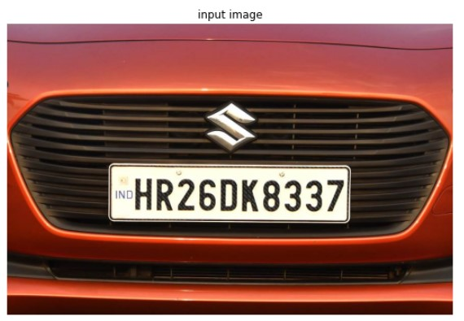
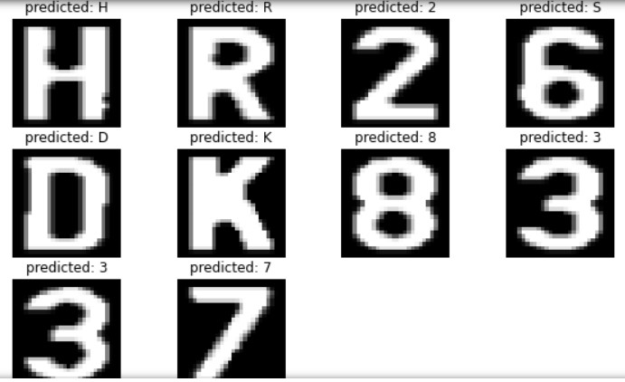

# License Plate Detection System

This GitHub repository contains version 1 code for a License Plate Detection system using deep learning with TensorFlow and OpenCV. The system detects license plates in images, segments the characters on the plate, and predicts the characters to recognize the license plate number.

## Table of Contents

- [Getting Started](#getting-started)
- [Prerequisites](#prerequisites)
- [Installation](#installation)
- [Usage](#usage)
- [Results](#results)

## Getting Started

These instructions will help you set up and use the License Plate Detection system.

## Prerequisites

Before you begin, ensure you have met the following requirements:

- Python 3.x
- TensorFlow
- OpenCV
- NumPy
- Matplotlib
- Any necessary dependencies mentioned in the code.

## Installation

1. Clone this repository to your local machine.

```bash
git clone https://github.com/yourusername/license-plate-detection.git
```

2. Install the required Python packages using pip.

```bash
pip install tensorflow opencv-python numpy matplotlib
```

## Usage

1. Place your license plate images in the appropriate directories. Images for training should be placed in `Train_Character/train`, and validation images should be placed in `Train_Character/val`.

2. To train the model, run the provided code by executing the script `train_model.py`. The model will be trained to recognize characters on license plates.

```bash
python train_model.py
```

3. To recognize license plates in an image, run the script `recognize_license_plate.py`. This script loads the trained model, detects license plates, segments characters, and predicts the license plate number.

```bash
python main.py
```

4. The recognized license plate number will be displayed and saved as an output image.

## Results

The License Plate Detection system provides the following results:

- Detection of license plates in input images.
- Segmentation of characters on the license plate.
- Prediction of the characters to recognize the license plate number.
- Display of the recognized license plate and saving it as an output image.





